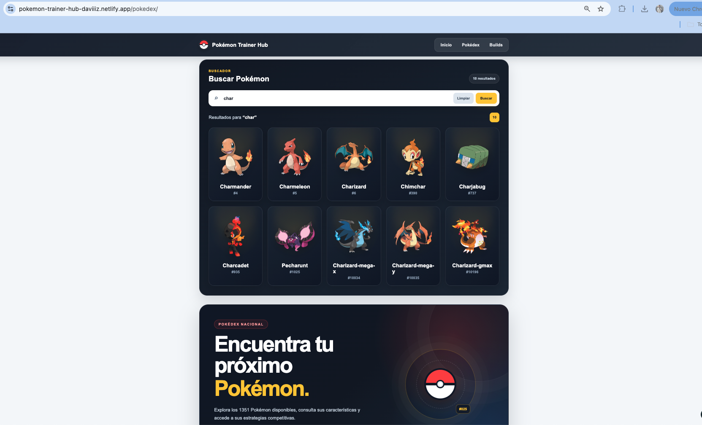
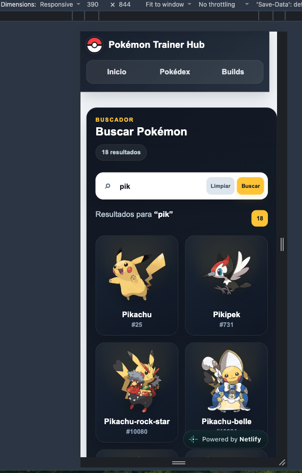

# Diseño — Pokémon Trainer Hub

## 1. Objetivo del documento

Este documento resume el sistema visual y la estructura de interfaz utilizados en la versión final de Pokémon Trainer Hub.

Incluye:

- wireframe de escritorio,
- wireframe móvil,
- paleta de colores,
- tipografía y jerarquías,
- componentes reutilizados,
- comportamiento responsive,
- estados de interfaz,
- criterios de accesibilidad y consistencia.

> Los wireframes incluidos representan la estructura final de referencia del proyecto.

---

## 2. Objetivo de la interfaz

Pokémon Trainer Hub busca ofrecer una experiencia clara para dos acciones principales:

1. consultar información de Pokémon mediante PokéAPI;
2. consultar builds competitivas almacenadas en la API propia.

La interfaz prioriza:

- navegación sencilla;
- búsqueda visible;
- jerarquía clara de contenidos;
- lectura cómoda;
- diseño responsive;
- consistencia entre Pokédex, detalle de Pokémon y builds.

---

## 3. Estructura principal del sitio

La aplicación se organiza en cinco tipos de página:

```text
/
├── Inicio
│
├── /pokedex
│   └── Buscador y catálogo Pokémon
│
├── /pokemon/:id
│   └── Detalle individual de Pokémon
│
├── /builds
│   └── Listado de builds competitivas
│
└── /builds/:id
    └── Detalle de una build
```

Todas las páginas comparten:

- cabecera,
- navegación,
- ancho máximo de contenido,
- estilos visuales,
- sistema de tarjetas,
- footer.

---

# 4. Wireframe — escritorio

## Vista de referencia: Pokédex

```text
┌──────────────────────────────────────────────────────────────────────────────┐
│ LOGO / Pokémon Trainer Hub                      Inicio | Pokédex | Builds    │
└──────────────────────────────────────────────────────────────────────────────┘

┌──────────────────────────────────────────────────────────────────────────────┐
│ BUSCADOR                                                                     │
│                                                                              │
│ Buscar Pokémon                                                0 resultados   │
│                                                                              │
│ ┌──────────────────────────────────────────────────────────────────────────┐ │
│ │ 🔎 Escribe un Pokémon...                                                 │ │
│ └──────────────────────────────────────────────────────────────────────────┘ │
└──────────────────────────────────────────────────────────────────────────────┘

┌──────────────────────────────────────────────────────────────────────────────┐
│ POKÉDEX NACIONAL                                      ÁREA VISUAL / SCANNER │
│                                                                              │
│ Encuentra tu próximo                                                        │
│ Pokémon.                                                                     │
│                                                                              │
│ Explora el catálogo, consulta sus datos                                      │
│ y accede a estrategias competitivas.                                         │
│                                                                              │
│ [1351 Pokémon] [PokéAPI] [Búsqueda instantánea]               ◉ #025       │
└──────────────────────────────────────────────────────────────────────────────┘

┌──────────────────────────────────────────────────────────────────────────────┐
│ RESULTADOS                                                                   │
│                                                                              │
│ ┌───────────────┐  ┌───────────────┐  ┌───────────────┐  ┌───────────────┐ │
│ │   Pokémon     │  │   Pokémon     │  │   Pokémon     │  │   Pokémon     │ │
│ │    imagen     │  │    imagen     │  │    imagen     │  │    imagen     │ │
│ │    Nombre     │  │    Nombre     │  │    Nombre     │  │    Nombre     │ │
│ │     #ID       │  │     #ID       │  │     #ID       │  │     #ID       │ │
│ └───────────────┘  └───────────────┘  └───────────────┘  └───────────────┘ │
└──────────────────────────────────────────────────────────────────────────────┘

┌──────────────────────────────────────────────────────────────────────────────┐
│ FOOTER                                                                       │
└──────────────────────────────────────────────────────────────────────────────┘
```

### Jerarquía en escritorio

1. Navegación principal.
2. Acción principal de la página: búsqueda.
3. Información contextual de la Pokédex.
4. Resultados.
5. Footer.

La búsqueda se sitúa antes que el bloque informativo para que la acción principal sea visible inmediatamente.

---

# 5. Wireframe — móvil

## Vista de referencia: Pokédex

```text
┌──────────────────────────────┐
│ Pokémon Trainer Hub         │
│ Inicio | Pokédex | Builds   │
└──────────────────────────────┘

┌──────────────────────────────┐
│ BUSCADOR                     │
│                              │
│ Buscar Pokémon               │
│                              │
│ ┌──────────────────────────┐ │
│ │ 🔎 Escribe un Pokémon... │ │
│ └──────────────────────────┘ │
└──────────────────────────────┘

┌──────────────────────────────┐
│ POKÉDEX NACIONAL             │
│                              │
│ Encuentra tu próximo         │
│ Pokémon.                     │
│                              │
│ Explora el catálogo y        │
│ consulta sus estrategias.    │
│                              │
│ [1351] [PokéAPI] [Instant.]  │
└──────────────────────────────┘

┌──────────────────────────────┐
│ RESULTADOS                   │
│                              │
│ ┌──────────────────────────┐ │
│ │      Pokémon imagen      │ │
│ │         Nombre           │ │
│ │          #ID             │ │
│ └──────────────────────────┘ │
│                              │
│ ┌──────────────────────────┐ │
│ │      Pokémon imagen      │ │
│ │         Nombre           │ │
│ │          #ID             │ │
│ └──────────────────────────┘ │
└──────────────────────────────┘

┌──────────────────────────────┐
│ FOOTER                       │
└──────────────────────────────┘
```

### Decisiones específicas para móvil

- El buscador permanece como primer contenido de la Pokédex.
- El hero se compacta para reducir scroll inicial.
- El elemento visual del scanner se oculta en pantallas pequeñas.
- Las tres métricas se muestran en una fila compacta.
- Las tarjetas pasan a una distribución adaptada al ancho disponible.
- Los textos y espaciados se reducen sin perder legibilidad.

---

# 6. Paleta de colores

La identidad visual utiliza una base oscura inspirada en interfaces de videojuegos, con amarillo como color de acción y acentos rojos asociados visualmente a Pokémon.

| Uso | Color | Hex |
| --- | --- | --- |
| Fondo general | Gris muy claro | `#f5f7fa` |
| Fondo principal oscuro | Azul noche | `#0f172a` |
| Fondo oscuro secundario | Gris azulado oscuro | `#111827` |
| Superficie oscura | Azul grisáceo | `#1e293b` |
| Acción / destacado | Amarillo | `#facc15` |
| Hover amarillo | Amarillo claro | `#fde047` |
| Acento Pokédex | Rojo | `#ef4444` |
| Texto principal claro | Blanco | `#ffffff` |
| Texto secundario | Gris azulado | `#cbd5e1` |
| Texto auxiliar | Gris | `#94a3b8` |
| Texto oscuro | Gris muy oscuro | `#111827` |

## Uso visual

```text
Fondos principales
#0f172a
#111827
#1e293b

Color de acción
#facc15

Acento
#ef4444

Texto
#ffffff
#cbd5e1
#94a3b8
```

El amarillo se reserva principalmente para:

- llamadas a la acción,
- etiquetas importantes,
- enlaces,
- indicadores,
- estados de foco.

---

# 7. Tipografía

El proyecto utiliza una familia tipográfica sans-serif del sistema:

```css
font-family: Arial, Helvetica, sans-serif;
```

## Jerarquía

### Títulos principales

- gran tamaño;
- peso alto;
- espaciado entre letras reducido;
- alto contraste con el fondo.

Ejemplos:

```text
Encuentra tu próximo Pokémon.
Construye tu estrategia.
```

### Títulos secundarios

Utilizados en:

- encabezados de secciones,
- buscador,
- tarjetas,
- builds.

### Texto de apoyo

Color más suave para diferenciarlo del contenido principal:

```text
#cbd5e1
#94a3b8
```

### Eyebrows / etiquetas

Se utilizan textos cortos en mayúsculas con:

- tamaño reducido,
- peso alto,
- letter-spacing amplio.

Ejemplo:

```text
POKÉDEX NACIONAL
BUSCADOR
ESTRATEGIA COMPETITIVA
```

---

# 8. Componentes repetidos

La interfaz reutiliza patrones visuales y funcionales para mantener consistencia.

## Header

Presente en todas las páginas.

Contiene:

- marca Pokémon Trainer Hub;
- navegación principal;
- acceso a Inicio;
- acceso a Pokédex;
- acceso a Builds.

---

## Hero

Bloque de presentación utilizado para:

- introducir una sección;
- destacar el objetivo de la página;
- mostrar información contextual.

Características:

- fondo oscuro con degradados;
- bordes redondeados;
- sombras;
- textos de gran jerarquía;
- elementos visuales decorativos.

---

## Tarjetas

Se utilizan para representar:

- Pokémon;
- builds;
- datos rápidos;
- estadísticas;
- movimientos.

Patrones comunes:

- bordes redondeados;
- sombra;
- superficie diferenciada;
- estados hover;
- separación clara entre información.

---

## Botones y enlaces de acción

Color principal:

```text
#facc15
```

Características:

- contraste elevado;
- peso tipográfico alto;
- feedback visual en hover;
- bordes redondeados.

---

## Formulario de búsqueda

Componente interactivo principal de la Pokédex.

Incluye:

- campo de búsqueda;
- icono;
- botón para limpiar;
- validaciones;
- mensajes de estado;
- resultados.

---

## Etiquetas

Se utilizan para:

- tipos Pokémon;
- roles;
- identificadores;
- datos resumidos.

---

# 9. Diseño responsive

El diseño se adapta a escritorio y móvil mediante media queries.

## Escritorio

La interfaz aprovecha el ancho disponible para:

- estructuras de dos columnas;
- grids de tarjetas;
- hero con contenido y elemento visual;
- mayor separación entre bloques.

## Móvil

La interfaz prioriza lectura y acciones principales:

- columnas transformadas en una sola columna;
- tarjetas adaptadas al ancho;
- reducción de paddings;
- títulos escalables;
- simplificación de elementos decorativos;
- buscador visible antes del contenido informativo.

Ejemplo de título responsive:

```css
font-size: clamp(...);
```

Esto permite adaptar el tamaño entre distintos anchos de pantalla sin depender únicamente de valores fijos.

---

# 10. Estados de interfaz

La aplicación comunica diferentes estados para evitar que la persona usuaria quede sin información.

## Estado inicial

Antes de realizar una búsqueda se muestra un mensaje que explica qué acción puede realizarse.

## Cargando

Durante una petición asíncrona se muestra un indicador visual.

```text
Cargando...
```

## Correcto

Los datos obtenidos se representan mediante tarjetas y páginas de detalle.

## Sin resultados

Si una búsqueda no obtiene coincidencias, se informa de forma comprensible.

## Error

Los errores se muestran mediante mensajes legibles para la persona usuaria, evitando exponer detalles técnicos internos.

---

# 11. Validaciones del formulario

La búsqueda de la Pokédex incorpora validaciones antes de realizar la consulta.

Entre ellas:

- campo obligatorio;
- longitud mínima;
- caracteres permitidos;
- mensajes comprensibles para corregir el valor.

El objetivo es evitar peticiones innecesarias y ofrecer feedback inmediato.

---

# 12. Accesibilidad y navegación

Se han aplicado decisiones básicas para mejorar la navegación:

- uso de elementos semánticos;
- enlaces y botones diferenciados;
- contraste entre texto y fondo;
- estados `hover`;
- estados `focus-visible`;
- navegación mediante teclado.

El foco visible utiliza el color principal de la interfaz:

```css
outline: 3px solid #facc15;
```

---

# 13. Relación entre diseño y funcionalidad

Las decisiones visuales están vinculadas al funcionamiento real de la aplicación.

## Pokédex

```text
Buscar
   ↓
Validar formulario
   ↓
Consultar PokéAPI
   ↓
Mostrar carga / error / resultados
   ↓
Abrir detalle de Pokémon
```

## Builds

```text
Consultar API propia
   ↓
Obtener builds desde MySQL
   ↓
Relacionar item y rol mediante JOIN
   ↓
Enriquecer Pokémon mediante PokéAPI
   ↓
Mostrar listado
   ↓
Abrir detalle de build
```

---

# 14. Criterio visual final

El diseño final persigue una apariencia:

- moderna,
- relacionada visualmente con Pokémon,
- limpia,
- consistente,
- responsive,
- orientada a la acción principal de cada página.

Se evitó añadir secciones o funcionalidades que no aportaran al circuito principal del MVP.

La prioridad final fue mantener un recorrido completo y funcional:

```text
Frontend
   ↓
API
   ↓
MySQL
   ↓
Respuesta
   ↓
Interfaz
```

---

# 15. Capturas de la implementación final

Las siguientes capturas muestran cómo los wireframes y decisiones visuales anteriores se trasladaron a la aplicación publicada.

## Vista de escritorio — Pokédex



## Vista móvil — Pokédex


